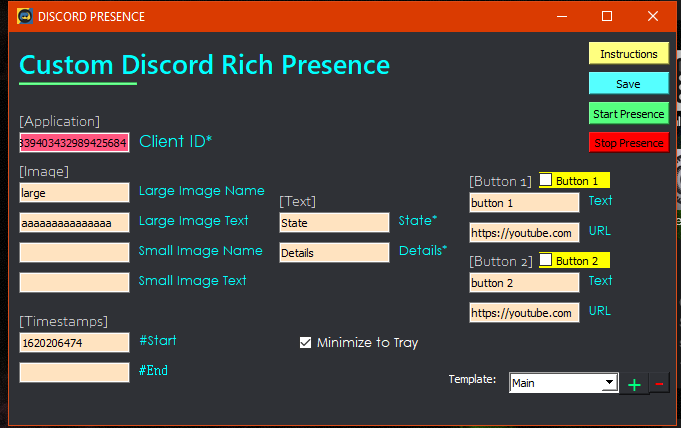

# custom_discord_presence
Create your own custom discord rich presence. This is my first project :p but I'm not dissapointed atleast

Hello :D

This program would allow you to create your own custom rich presence in discord.

Here's an example:

# Custom Discord RPC
**So how do I use this?**

You have to extract the zip and store the folder in the zip somewhere. You can either directly run it from the folder, or, create a shortcut and use it.

>How to create an application?

* Go to [this link](https://discord.com/developers/applications) and create a new application.
* Name that application the name of your presence. (eg: Call of Duty mobile as in above example)
* Go to the Rich Presence section in the left pane.
* You will be on the Assets tab and from there you can add as much as you want... But make sure you note your image key-names. You will be needing them.

> How to setup the presence?

* Enter your application's ID. That is, the CLIENT ID that's situated right below your application name.

* If, you have images uploaded, enter their key names respectively.

* The client ID, State and Details are required.

* Timestamps are optional. You can get these by visiting [here](https://www.epochconverter.com)

> How do I disable the presence?
* You can just quit the program. It will close your presence.

> How do I save my presence information so I don't have to retype it again?
* After you enter your information, clicking 'Start Presence' would automatically save them. So when you open the application next time, the information is already entered and all you have to do is start it.

> How do I something I did is wrong?
* Simple. The program would crash :joy:
* Sorry, I'll handle errors soon.

<marquee>==========Have fun!✌️============</marquee>

## Screenshot

ik the colorful UI is cringe.