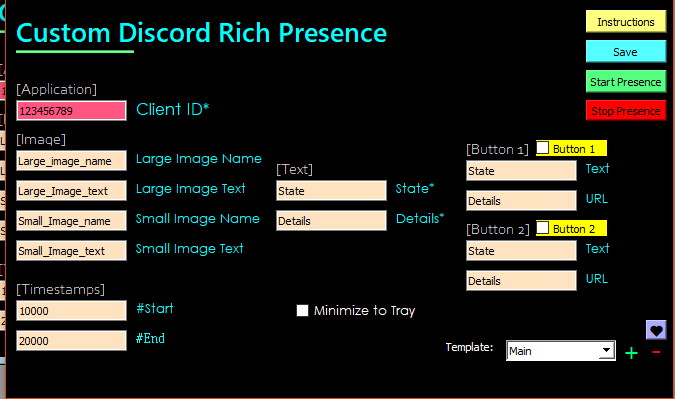

# custom_discord_presence
Create your own custom discord rich presence. This is my first project :p but I'm not dissapointed atleast

Hello :D

This program would allow you to create your own custom rich presence in discord.

Here's an example:

# Custom Discord RPC

<h2> What's new? <h2>

____

* Added Buttons.
* Added Template remove function.
* Added UI colors.

**So how do I use this?**

Install the application anywhere you like using the installer. Go to the directory you have installed it and run _Custom Discord Presence.exe_. It can be a little slow so because the files are compressed. Create a shortcut and send it to your desktop if you need.

>How to create an application?

* Go to [this link](https://discord.com/developers/applications) and create a new application.
* Name that application the name of your presence. (eg: Call of Duty mobile as in above example)
* Go to the Rich Presence section in the left pane.
* You will be on the Assets tab and from there you can add as much as you want... But make sure you note your image key-names. You will be needing them.

> How to setup the presence?

* Enter your application's ID. That is, the CLIENT ID that's situated right below your application name.

* If, you have images uploaded, enter their key names respectively.

* The client ID, State and Details are required.

* Timestamps are optional. You can get these by visiting [here](https://www.epochconverter.com)

* If you decide to leave the optional ones, just leave them blank. Timestamps would create 'None' inside the box when you open the app next time, either leave it like that or erase it doesn't make a difference.

> How do I disable the presence?
* THE RED STOP BUTTON UR WELCOME. (It takes a little time to clear the presence, like 5 seconds)

> How do I save my presence information so I don't have to retype it again?
* Hit save. Also, when you enter your information and hit start presence, it'll automatically save it too. The save button is an alternative.

> How do I create multiple saves?
* Click on the plus button and enter your new template name. Hit Ok and you can save changes by going into that template and clicking the save button. (Made it easier in V1.2)

* When you click save, with your template selected from the drop down, it'll save to that template.

* Also, the application would start in the 'Main' template selected the next time you open it.

> How do I add buttons?
* Make sure you enter your button name and it's URL in the correct place. Then check the CheckBox above it.

* Note: Ig it's not possible for you to open your own link, but other people viewing your presence can.

> Any User Interface templates?
* There's a directory called 'UI'. Go inside it and copy the .ui file you want and paste it in the installation directory. Replace the existing one. The existing one is the grey coloured(discord color) background and it's default.

> How do I something I did is wrong?
* Simple. The program would crash :joy:
* Sorry, I'll handle errors soon.

___

## Screenshot

___
# Feedback

Add me on discord **Yeti#1652**

Thanks <3!

# Contributor

<a href="https://www.github.com/HiTechGen">HiTechGen</a>
